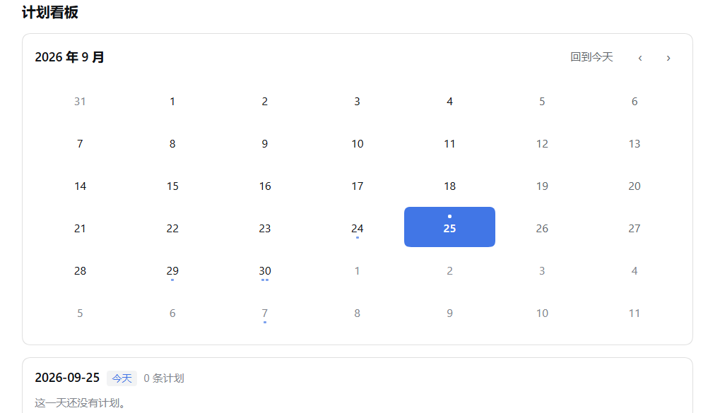

# dsh-planner · 计划看板

[](https://github.com/qcsjjjjj/dsh-planner/actions/workflows/tests.yml)
[](LICENSE)

**给你的 DSH 加一个"计划"标签页**：日历 + 按天排的计划卡片，就在 `对话`、`轨迹` 右边。
你也可以直接对 AI 说"帮我看看下周三有什么"，或者"每周一早上加个周会"——它能读也能改你的计划。

> A planner board for the DeepSeek Harness Web GUI: a calendar plus per-day plan cards as a third
> tab in the centre column, with recurring plans and five model-facing tools so the agent can read
> and edit your plans in conversation. No build step, no runtime dependencies. Chinese-first UI.
> Full usage below is in Chinese (matching the product); engineering notes live in
> [docs/DESIGN.md](docs/DESIGN.md).

<!-- 截图位：把一张图存成 docs/screenshot.png，再把下面这行的注释符号去掉即可。
     GitHub 会直接显示它；插件市场在没有 screenshots.json 时也会自动从 README 抽取图片。

-->

---

## 它能做什么

### 日历在你手上
上半部分是一张日历卡片，圆角、周一起始。左上角显示年月，右上角有 `‹` `›` 翻月和 `回到今天`。

三种视觉状态一眼分清：

| | 样式 |
| --- | --- |
| **今天** | 数字**上方**一个小蓝点，数字加粗 |
| **选中的日期** | 一整块蓝色实心圆角，数字反色 |
| **有计划的日期** | 数字**下方**最多三个小圆点，表示当天有几条计划 |

"今天"和"选中"用**位置**区分而不是颜色深浅——两者叠在一起时也不会糊掉。

### 计划卡片
选中哪天，下半部分就列哪天的计划，按开始时间排序。每张卡片上有：

- 左边一道**颜色竖条**表示重要度：**高**（红）/ **中**（琥珀）/ **低**（蓝），右侧还有一个对应颜色的小标签
- 标题、时间范围（`14:00 – 15:00`）
- 内容（多行，可留空）
- 左边一个**方形完成框**，勾上就划线置灰，再点可撤销
- 右边 `✎` 编辑、`✕` 删除

时间重叠的两条计划会带一个 `⚠`——**只是提示，不拦你**。同一天本来就可能几件事并行。

### 新建与编辑用同一个浮窗
右下角 `新建` 打开浮窗：标题、内容、开始时间、结束时间、重要度。
时间用系统自带的选择器（键盘和手机上都好用）；标题必填、结束时间必须晚于开始时间，
不满足时"确定"会灰掉并说明原因。**编辑复用同一个浮窗**，字段已填好。

### 删除可以后悔
点 `✕` 直接删掉，底部随即出现 `已删除「…」  撤销`，**5 秒内**点一下就能恢复。

### 一键躺平
右下角 `一键躺平` 清空当天的全部计划，会先弹确认框并**写明条数**。
如果你的重复计划也落在那天，它会**只跳过这一天，系列本身不动**——确认框里会专门说明这一点
（例如"其中 2 条属于重复计划，仅跳过该日"）。清空后同样可以撤销。

### 重复计划
新建时选 `重复`：**不重复 / 每天 / 每周 / 工作日**。选了非"不重复"会多出一行**截止日期**（可留空＝永不结束）。
那一行还会实时告诉你规则具体落在哪天，例如 `从 2026-09-30 起，每周三`。

- **每周**按你开始那天的星期几重复（在周三建的就是每周三）
- 编辑或删除重复计划时，会问你「**仅此一次 / 整个系列**」——默认的"仅此一次"放在主位，
  破坏性大的"整个系列"用危险色放在旁边。改一次会议时间不会波及整个系列
- **完成状态按天独立**：勾了这周三，不影响下周三

### 过去的日期不能补建
翻到过去的日期，`新建` 会变灰（悬停有说明），但**仍然可以编辑、勾完成、删除、躺平**——
补记纠错都合理，只是不让你手滑新建。（Agent 走的是另一条路，见下。）

### 和主题一致
配色全部取产品的主题变量，明暗主题下都正常，没有一处硬编码颜色。

---

## 让 AI 帮你记

这是这个插件比较特别的地方：装上之后，**AI 在对话里就能读写你的计划**，
不需要你去点界面。你可以直接说：

> "看看我下周三有什么安排"
> "帮我把周三下午的评审挪到周四上午十点"
> "每周一早上九点加一个周会，先排两个月"
> "周三我什么都不想干了，清空吧"
> "把昨天下午那场会补记一下"
> "刚才那次删错了，撤销"

它能做的事：

| 动作 | 说明 |
| --- | --- |
| **看** | 读某一天或某个日期区间，默认"今天起 7 天" |
| **建 / 改** | 建计划、改计划、设重复与截止日期；改的时候只说你要改的那一项，**其余字段自动保持不变** |
| **删** | 删一条；重复计划可以只跳过这一次，或删掉整个系列 |
| **清空** | 清空一整天（相当于帮你按一键躺平） |
| **撤销** | 撤销刚才那次删除或清空 |

两个刻意的设计：

- **重复计划的删除是"可撤销"的**。界面里删错了有 5 秒撤销条，AI 操作时没有这个条，
  所以它每次删除都会记下撤销凭据——你说一句"撤销"就能回来。
- **清空一整天需要它"明确确认一次"**，不是随手就能清掉。而删除单条不需要这道关卡——
  那个是灵活的日常操作。

**关于过去日期**：界面上不许为过去新建，但 AI 可以——因为"把昨天那场会补记一下"是真实需求。
代价是它会**在结果里明确写出"这是为过去日期补记的"**，让你看得见。它被要求只在你明确要求补记时才这么做。

---

## 安装

需要 **DSH 0.1.5-rc.3 或兼容版本**（web profile），以及 PATH 上的 `pnpm` 与 Node.js ≥ 20。

```sh
dsh plugin --profile web add github:qcsjjjjj/dsh-planner
```

装完**重启一次 `dsh web`**（插件的加载名单在启动时组装），然后刷新页面，
标签条上就会出现 `计划`。

想固定版本就用 tag：

```sh
dsh plugin --profile web add github:qcsjjjjj/dsh-planner#v0.1.0
```

卸载：

```sh
dsh plugin --profile web remove dsh-planner
```

标签随之消失，**你的数据不会被删**。

**关于 `private: true`**：`package.json` 里故意保留了它（DSH 本地插件的惯例），
它挡住误发 npm，不影响 `github:` 与 tarball 安装。想发布 npm 就删掉这一个字段。

---

## 你的数据

计划存在你自己的机器上，纯 JSON 文件，一个日期一个文件：

```
~/.dsh/storages/planner/
├── plans/2026-09-30.json     单次计划（按日期）
├── series.json               重复系列的定义
└── undo.json                 最近一次删除/清空的撤销凭据
```

- **想备份就复制整个 `planner/` 目录**，想迁移就把它放到另一台机器的同一位置。
- 写入是原子的（临时文件 + `fsync` + 改名），断电或崩溃时不会留下半个文件。
- 某个文件万一损坏，会被改名成 `<日期>.json.corrupt-<时间戳>` **留档**，而不是被丢掉；
  那一天按空处理，**其余日子照常显示**。
- 没有云端、没有遥测、没有网络请求。

---

## 已知限制

- **界面是中文的**（与 `对话`/`轨迹` 一致）。词典里已有英文，但日历表头、星期名等仍是硬编码中文，
  完整双语是一件独立的事。
- **撤销是单层的**——只记得最近一次删除或清空（和界面那个 5 秒撤销条语义一致）。
- **一键躺平只能按天**，没有"清空一个日期区间"。
- **重复规则只有三种**（每天 / 每周 / 工作日），没有每月、没有"每 N 天"、没有"重复 N 次"。
- **不做跨天计划**：一条计划属于一天，时间和日期都是本地的。

---

## 开发

```sh
node .dev/run-tests.mjs      # 四套离线测试，477 条断言
```

测试**不需要安装 DSH**：它用临时目录驱动真实的 `lib/` 与 `client/` 代码。
只有少数几条依赖 `@deepseek-ai/dsh-tools` 的 schema 校验断言，在找不到该包时会自动跳过。

| 目录 | 内容 |
| --- | --- |
| `lib/` | 宿主半边：HTTP 路由、持久化、模型工具 |
| `client/` | 浏览器半边：标签页与计划看板（经典脚本，非 ESM） |
| `.dev/` | 离线测试与开发用小工具，不属于插件交付物 |
| `docs/DESIGN.md` | **设计与实现说明**：架构、数据结构、以及为什么这样选 |

**改 `client/client.js` 不需要重启、也不需要刷新页面**——产品的 HMR 会在约 500ms 内热替换。
改 `lib/` 下的宿主半边需要重启一次。

架构、存储格式、模型工具的协议约束、以及若干"为什么是这样"的取舍，都在
[docs/DESIGN.md](docs/DESIGN.md)。

## 许可

[MIT](LICENSE)
